# AWS Two-Tier Infrastructure using Terraform

<p align="center">


</p>

## 📖 Overview

This project provisions a production-inspired **AWS Two-Tier Architecture** using **Terraform** and follows Infrastructure as Code (IaC) best practices. The infrastructure is deployed across two Availability Zones and includes secure networking, an Application Load Balancer, Auto Scaling Group, EC2 instances, Amazon RDS MySQL, IAM, and a remote Terraform backend using Amazon S3 and DynamoDB.

---

# 🏗️ Architecture

<p align="center">
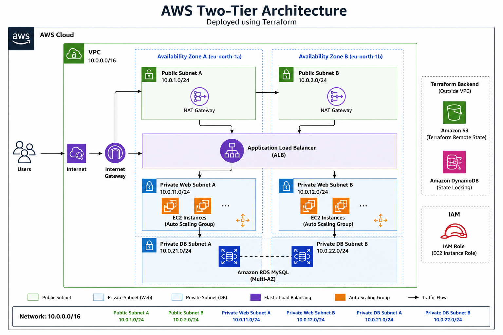
</p>

## ✨ Features

- Modular Terraform project
- Custom VPC (10.0.0.0/16)
- Public & Private Subnets
- Internet Gateway & NAT Gateway
- Application Load Balancer
- Launch Template
- Auto Scaling Group
- Amazon RDS MySQL
- IAM Role & Instance Profile (with SSM access, no SSH key required)
- S3 Remote Backend
- DynamoDB State Locking
- Separate Bootstrap module for provisioning Terraform Remote Backend (Amazon S3 + DynamoDB)

## 🌐 Network Layout

| Resource | CIDR |
|----------|------|
| VPC | 10.0.0.0/16 |
| Public A | 10.0.1.0/24 |
| Public B | 10.0.2.0/24 |
| Private Web A | 10.0.11.0/24 |
| Private Web B | 10.0.12.0/24 |
| Private DB A | 10.0.21.0/24 |
| Private DB B | 10.0.22.0/24 |

## ✅ Prerequisites

Before deploying, make sure you have:

- An **AWS account** with permissions to create VPC, EC2, ALB, Auto Scaling, RDS, IAM, S3, and DynamoDB resources
- **AWS CLI** installed and configured (`aws configure`) with valid credentials
- **Terraform** `>= 1.5` installed locally
- A globally unique name in mind for your own S3 state bucket (see [Stage 1](#stage-1--bootstrap-backend) below — this repo's default bucket name belongs to the original author and will not work for you)

## 🚀 Deployment

The infrastructure deployment follows two stages.

### Stage 1 – Bootstrap Backend

The `bootstrap/` module provisions the S3 bucket and DynamoDB table used for Terraform's remote state. Its default bucket name (`kshitij-shrivastava-terraform-state-2026`) belongs to the original author — **S3 bucket names are globally unique, so you must change it** before applying.

1. Open `bootstrap/variables.tf` and change the `bucket_name` default (or pass your own with `-var`) to something unique, e.g. `your-name-terraform-state-<year>`.
2. Provision the backend:

```bash
cd bootstrap
terraform init
terraform apply
```

This provisions:

- Amazon S3 Bucket (Terraform Remote State)
- Amazon DynamoDB Table (Terraform State Locking)

### Stage 2 – Deploy Main Infrastructure

1. Update the root `backend.tf` so `bucket` and `dynamodb_table` match exactly what you created in Stage 1 (Terraform backend blocks can't reference variables, so these values must be hardcoded here).
2. Copy the example variables file and fill in your own values:

```bash
cd ..
cp terraform.tfvars.example terraform.tfvars
```

Edit `terraform.tfvars` and set your `db_password` and any other values you want to change. **Do not commit this file** — it's already excluded via `.gitignore`.

3. Deploy:

```bash
terraform init
terraform apply
```

This provisions:

- VPC
- Public and Private Subnets
- Internet Gateway
- NAT Gateways
- Security Groups
- IAM Role
- EC2 Launch Template
- Auto Scaling Group
- Application Load Balancer
- Amazon RDS MySQL

## 🔑 Accessing the EC2 Instances

Web instances run in **private subnets** and have no SSH key pair attached. Access is instead via **AWS Systems Manager Session Manager**, enabled through the IAM instance profile (`AmazonSSMManagedInstanceCore`):

```bash
aws ssm start-session --target <instance-id>
```

You can find the instance IDs in the EC2 console or via the `aws ec2 describe-instances` CLI command.

## 📊 Terraform Apply

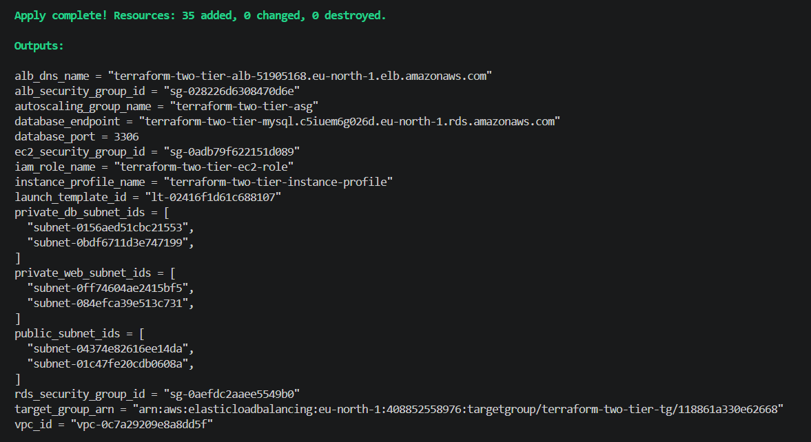

## 📈 Terraform Outputs

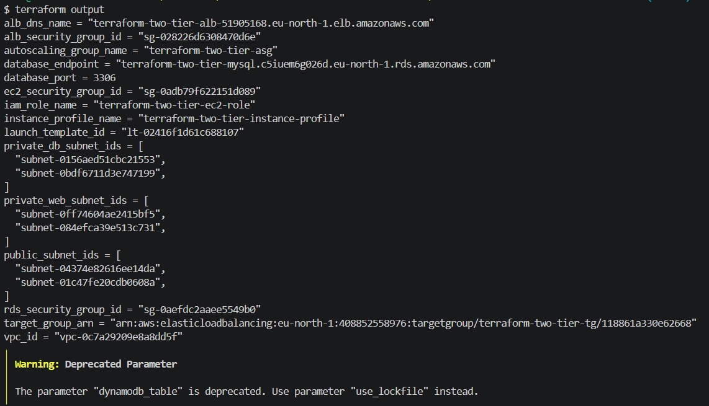

## 🌍 Application Output

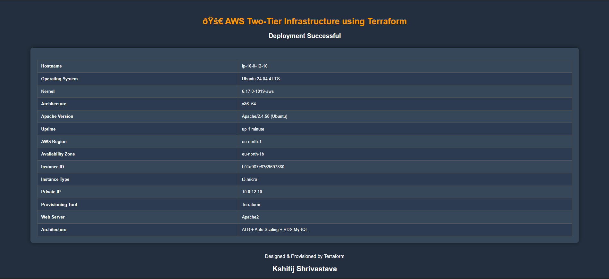

# AWS Console Resources

## VPC
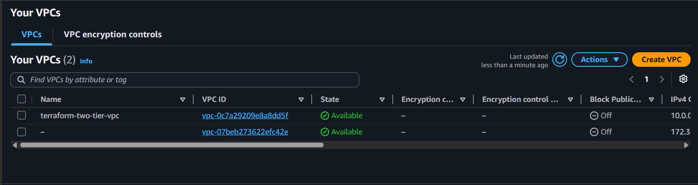

## Subnets
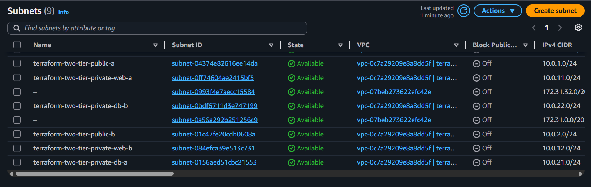

## Route Tables
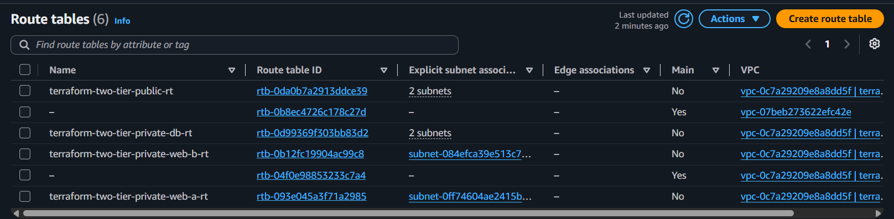

## Internet Gateway
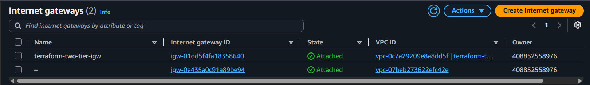

## NAT Gateway
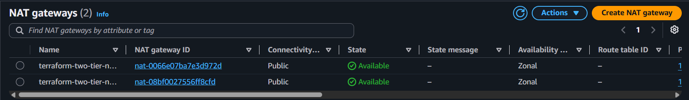

## Security Groups
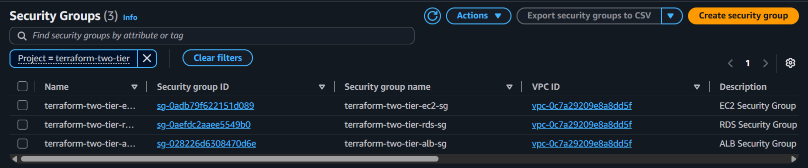

## Launch Template
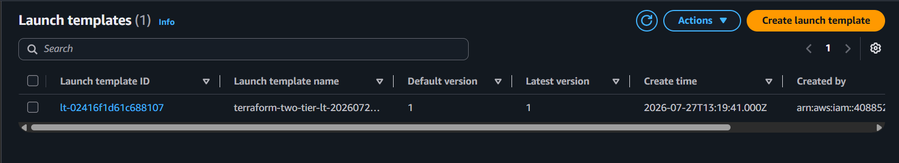

## Auto Scaling Group
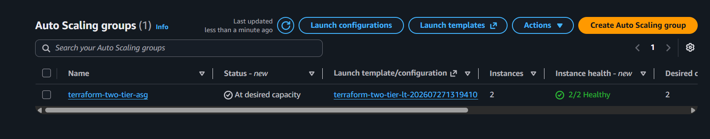

## Application Load Balancer
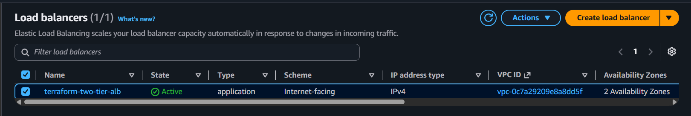

## Target Group
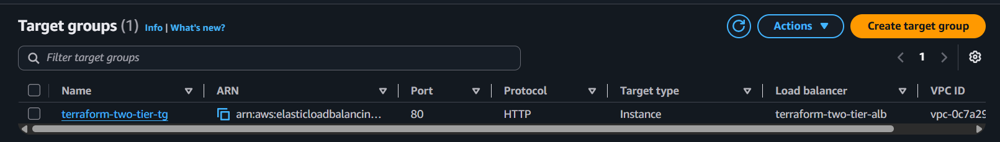

## EC2 Instances
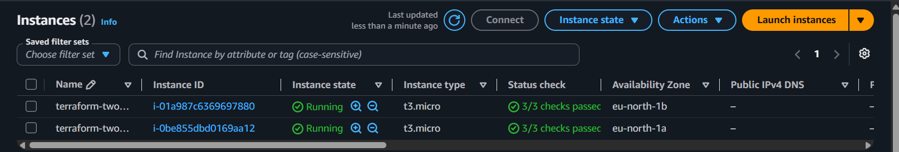

## Amazon RDS
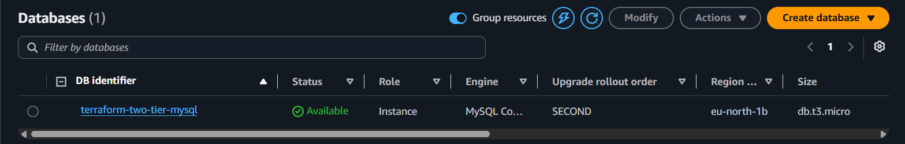

## DB Subnet Group
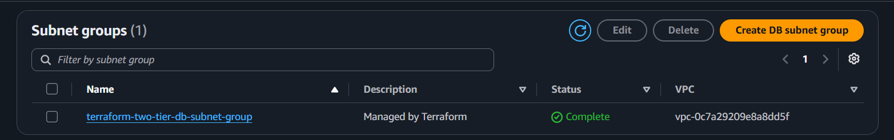

## IAM Roles
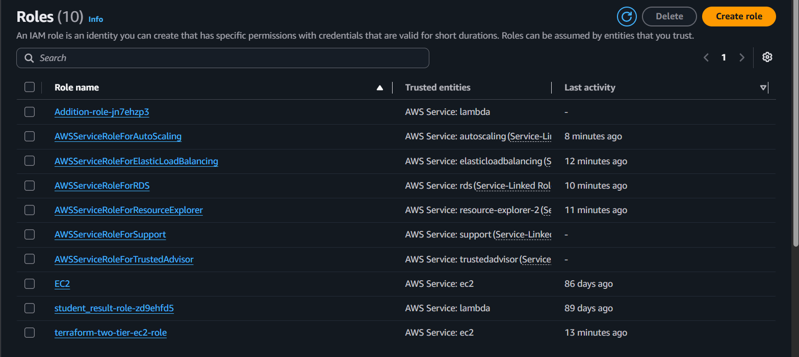

## Bootstrap Module

The `bootstrap/` directory contains a separate Terraform configuration used to provision the remote backend infrastructure required by the main project.

It creates:

- Amazon S3 Bucket for storing the Terraform remote state
- Amazon DynamoDB Table for Terraform state locking

This bootstrap configuration is executed only once before deploying the main infrastructure.

After the backend resources are created, the main Terraform configuration uses them for remote state management.

## S3 Remote Backend
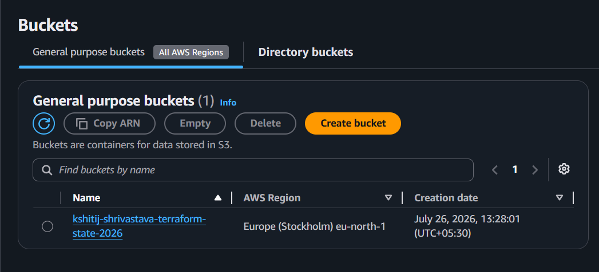

## DynamoDB State Lock
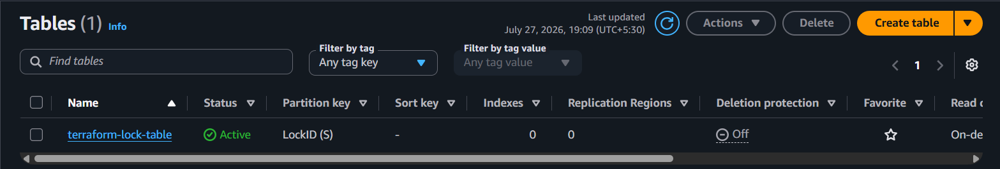

## 🔒 Security

- IAM Roles instead of hardcoded credentials
- Private subnets for application and database tiers
- Security Groups implementing least privilege
- Remote Terraform state with state locking
- Instance access via SSM Session Manager instead of SSH key pairs

## 📚 Skills Demonstrated

- Terraform Modules
- AWS Networking
- EC2 & Auto Scaling
- Application Load Balancer
- Amazon RDS
- IAM
- Remote Terraform Backend
- Infrastructure as Code
- Troubleshooting AWS deployments

## 💰 Cost Notice

This project provisions **billable AWS resources**, including two NAT Gateways, an Application Load Balancer, and an RDS instance — all of which incur hourly charges even when idle.

When you're done testing, tear down in this order:

1. Destroy the main infrastructure:

   ```bash
   terraform destroy
   ```

2. Then destroy the bootstrap backend:

   ```bash
   cd bootstrap
   terraform destroy
   ```

   Note: the S3 state bucket has versioning enabled, so `terraform destroy` will fail if it isn't empty. Empty the bucket (including all object versions) first, e.g. via the S3 console or `aws s3 rm s3://<bucket-name> --recursive`.

## 🚀 Future Enhancements

- HTTPS with ACM
- Route 53
- CloudWatch Monitoring
- Jenkins CI/CD
- Dockerized Spring Boot Deployment
- GitHub Actions

## 👨‍💻 Author

**Kshitij Shrivastava**

- GitHub: https://github.com/kshitijshri99
- LinkedIn: https://linkedin.com/in/kshitij-shrivastava-17551b172/

## 📄 License

This project is licensed under the **MIT License**. See the [LICENSE](LICENSE) file for details.
